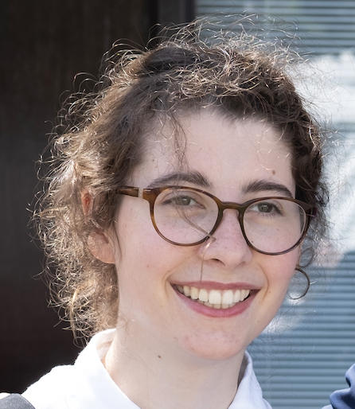

I am a postdoctoral researcher in Computational Neuroscience at [Stanford University](https://www.stanford.edu), advised by [Prof. Surya Ganguli](https://ganguli-gang.stanford.edu/surya.html) and [Prof. David Sussillo](https://scholar.google.com/citations?user=ebBgMSkAAAAJ&hl=fr). My work broadly focuses on trying to understand the mechanisms that underlie various brain computations, using a mix of theory, computational modelling, and data analysis. I am also interested in generative modelling, and development of new methods to dissect datasets of neural recordings.
I grew up in [Paris](https://fr.wikipedia.org/wiki/Paris), and moved to [Cambridge](https://en.wikipedia.org/wiki/Cambridge) for my undergraduate and Masters in Physics. I then stayed there to do a PhD in Computational Neuroscience, advised by [Dr Guillaume Hennequin](https://cbl.eng.cam.ac.uk/hennequin/). 
<!-- Outside of research I enjoy water sports, cooking, and discovering new places and foods with friends and family! -->
<!-- research fellow in Molecular Modelling and Probabilistic Machine Learning at the [University of Cambridge](https://www.cbl-cambridge.org/people/ja666). My interests span generative models applied to molecular modelling, probabilistic modelling, approximate inference and information theory. My PhD research focused on scalable probabilistic reasoning with neural network models. I graduated from the University of Zaragoza in 2018 with an honorary distinction ("premio extraordinario") in Telecommunications Engineering (EE/CS). I was awarded an MPhil in Machine Learning with distinction by the University of Cambridge in 2019. I also do freelance engineering consulting and am a co-founder of [arisetech.es](http://arisetech.es). Bellow are links to some of my recent work, where \* denotes equal contribution. -->